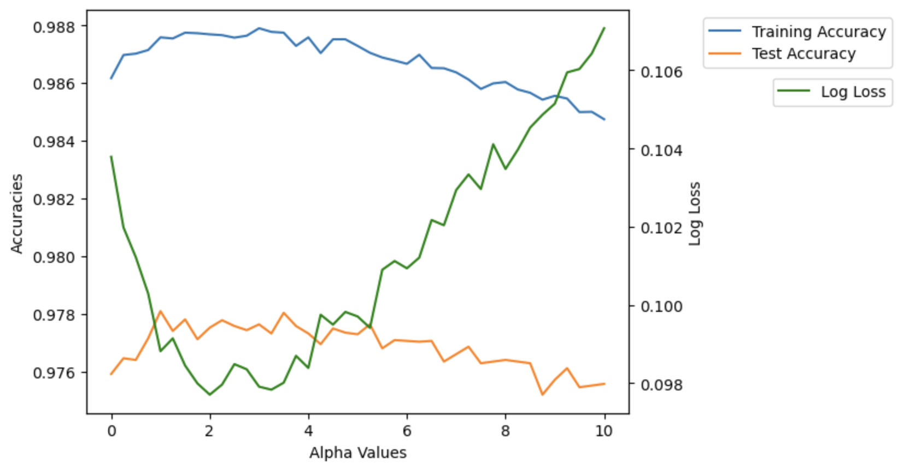
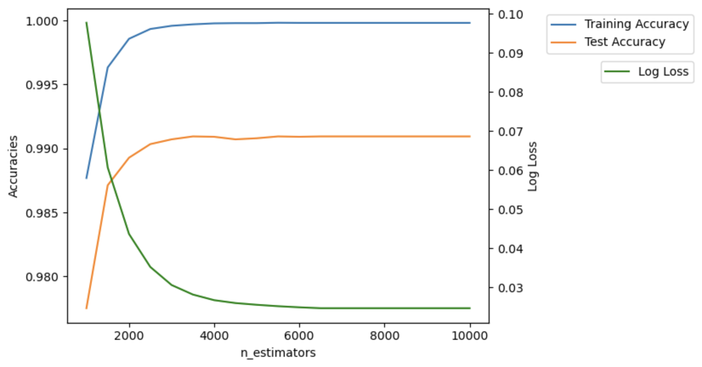
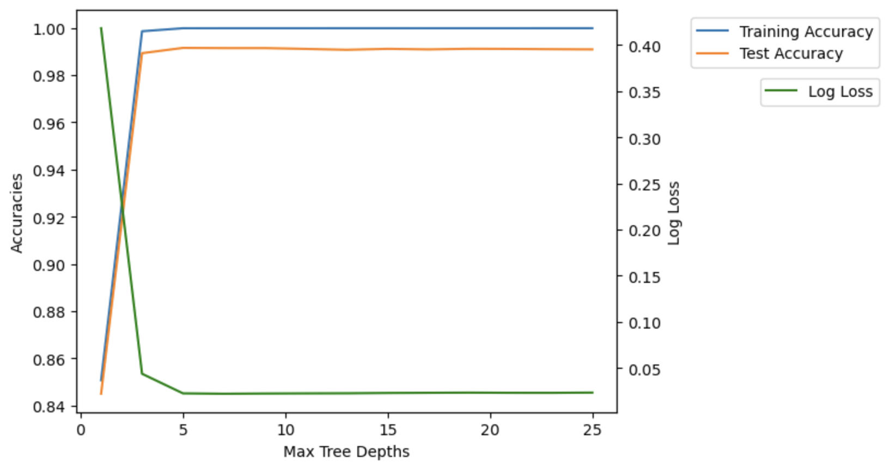
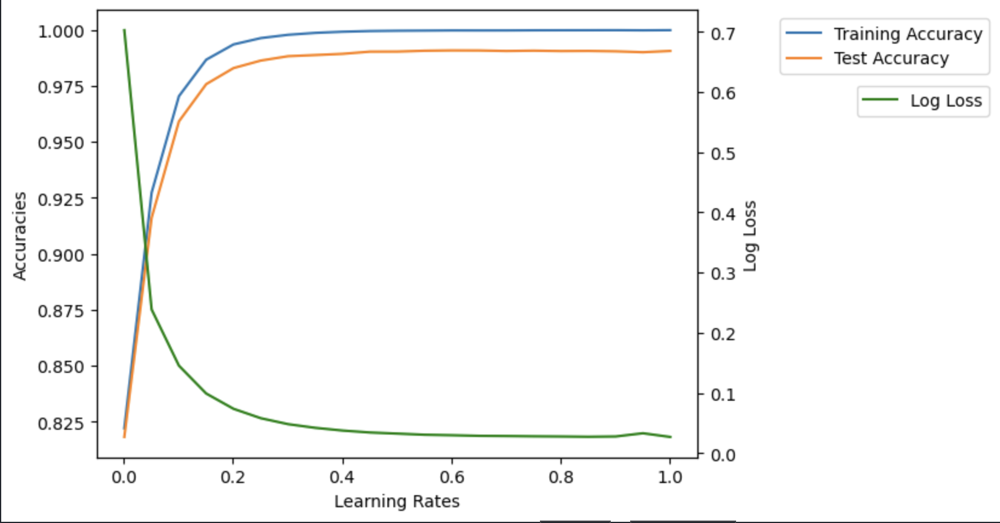
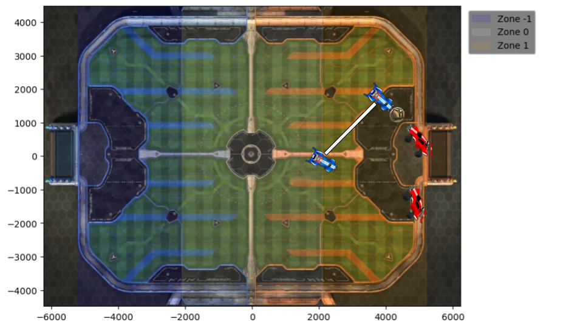
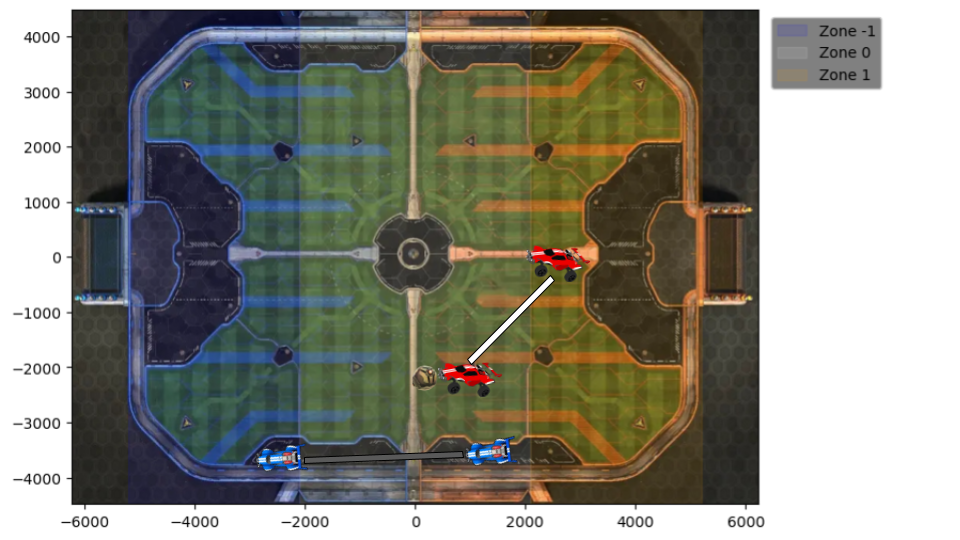
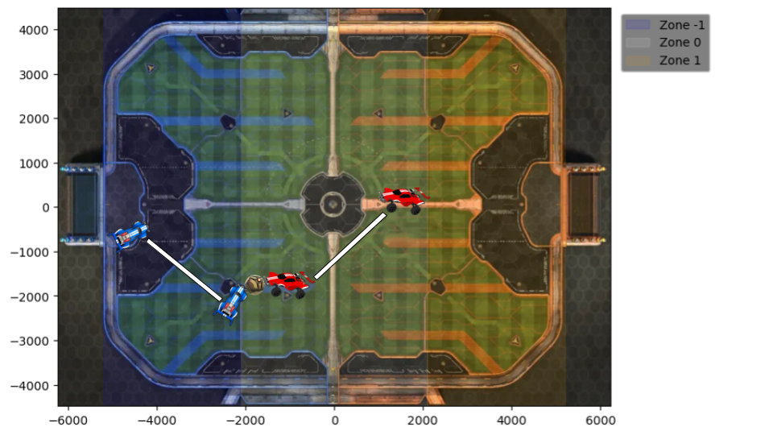

# <center>Using Machine Learning for Pro-Level Rocket League Gameplay Analysis</center>

## Table of Contents:

* [Introduction](#introduction)
    * [Game IQ vs Mechanics](#game-iq-vs-mechanics)
    * [Improving Game IQ and Mechanics](#improving-game-iq-and-mechanics)
* [Using a Data-Driven Approach to Improve Game IQ](#using-a-data-driven-approach-to-improve-game-iq)
    * [Getting `.replay` and `.json` Files](#getting-replay-and-json-files)
    * [Turning the `.json` Files into a Pandas `DataFrame`](#turning-the-json-files-into-a-pandas-dataframe)
    * [Creating Important and Relevant Variables](#creating-important-and-relevant-variables)
    * [Reshaping the Data for Use with ML Models](#reshaping-the-data-for-use-with-ml-models)
    * [Data Preparation](#data-preparation)
    * [Data Preprocessing](#data-preprocessing)
    * [Training the Model](#training-the-model)
        * [Tuning Hyperparameters](#tuning-hyperparameters)
        * [Verifying Results of the "Best" Model](#verifying-results-of-the-best-model)
    * [Using the Model to Learn Best Positioning Practices from Pro Players](#using-the-model-to-learn-best-positioning-practices-from-pro-players)
* [Conclusion, Areas of Improvement, and Future Work](#conclusion-areas-of-improvement-and-future-work)
    

## <center>Introduction<center> <a id="introduction"></a>

Rocket League is a competetive, RC-Car Soccer game that has become one of the most popular and major esport games on the market. With about 90 million monthly players on average, the large playerbase lends itself to a diverse rank separation. With the ranking system of 22 ranks from Bronze I (total beginners) to Supersonic Legend (top-level and pro players), gameplay between the ranks vary drastically. As one moves through the ranks, progress becomes slower and harder to make. Ways to improve become more and more specific depending on playstyle and the circumstances in which one feels the need to improve. There are 2 main ways to improve one's skill level in the game: Game IQ and Mechanics.

### <center>Game IQ vs Mechanics<center> <a id="game-iq-vs-mechanics"></a>

Mechancics are defined as skill-based controller inputs that allow for detailed and controlled manipulation of both the player's car and the ball. Mechanical skills range from simple, ground car control to gravity-defying displays of car and ball mastery. Learning mechanics is a long, arduous process that takes more and more time to learn the harder and fancier the mechanics become. For instance, learning how to 'fast arial' (one of the more basic mechanics) takes about a couple hours of practice, while learning how to master car control via 'directional air rolling' can take days if not months of deliberate practice.

Game IQ is defined as the accumulated gameplay knowledge of a player from when they start playing to where they are currently. Otherwise known as "game sense", it allows a player to make the "best" decision (to the best of their knowledge) in a certain scenario given information on their teammates and the opposing players. Game IQ usually manifests itself in Rocket League as a decision-making process. Scenarios such as when you and your team stop the opposing team's attack have a myriad of subsequent actions. "Should we shoot the ball directly at their net, forgoing possession? Should I clear the ball up the sideline so that my teammate can take control to make a play? If I do that, should I go upfield with them to be in position to receive a pass, or should I stay back in case of a wild clear that goes towards our goal?" is a thought process that often needs to happen in a split second, and choosing the "best" option can be a hard decision.

### <center>Improving Game IQ and Mechanics<center> <a id="improving-game-iq-and-mechanics"></a>

Improving both of these skills is essential to climbing the ranks in the game. Both are time-based commitments. Mechanics often take much longer to improve than Game IQ due to the need for long, rigourous, and active training. Game IQ, however, is much more general; akin to how language learners acquire a second language, taking in input from people more skilled than you can allow you to learn much faster than by both self-teaching and learning through experience. 

Pro-level players have often put more than 10,000 hours into the game, and have a mastery on both Mechanical skill and Game IQ. One can learn a lot from watching pro-level gameplay from both a Mechanics point of view and a Game IQ point of view. The difference between the two is that knowledge gained on Game IQ is easier to implement than Mechanics, due to the fact that a player needs to set aside time and effort for *deliberate practice* to better their mechanical skill. In order to implement Game IQ knowledge, all one has to do is join a match and attempt to apply the knowledge. 

## <center>Using a Data-Driven Approach to Improve Game IQ<center> <a id="using-a-data-driven-approach-to-improve-game-iq"></a>

Rocket League has a feature in the game in which one can save a replay of their match in a local file directory as a `.replay` file. Thanks to the open source Rocket League replay decompiling and analysis python library [carball](https://github.com/SaltieRL/carball) (carball is only supported on python 3.8 and prior; I set up a .venv in my working directory to use it. There is probably a smarter way to work around this) and the website [Rocket League Replay Parser](https://rl.nickb.dev/), one can take a `.replay` file, upload it to Rocket League Replay Parser to get a formatted `.json` file, and then parse through the `.json` file using carball to obtain a Pandas `DataFrame` object. Using those tools in conjunction with the replay uploading website [ballchasing](https://ballchasing.com/), I was able to gather over 250 pro-level matches in order to analyze player positioning given a certain play. After some data wrangling, feature engineering, and preprocessing, I was able to train a Boosting Classifer from the popular ML package `XGBoost` to classify plays in a match, and used the classifications to analyze gameplay on unseen data.

For this analysis, I specified on ballchasing that the only replays I download are to have at least one pro player in the lobby, and that the games are limited to ranked 2v2s (the most popular game mode). All the code used can be seen in the project directory, but I provide the model definition, data splitting, and positional analysis code in the document to showcase my workflow and insights.

### <center>Getting `.replay` and `.json` Files<center> <a id="getting-replay-and-json-files"></a>

By making calls to [ballchasing's API](https://ballchasing.com/doc/api), I was able to download 265 replays and store them in a local file directory on my PC. Using the `requests` and `os` modules, I made API calls to [ballchasing](https://ballchasing.com/)'s website and downloaded the raw replays into a file in my working directory.

After downloading all `.replay` files, I moved on to automating the uploading of those files to [Rocket League Replay Parser](https://rl.nickb.dev/) to get their respective `.json` files and download them into another local file. I used the `selenium` and `os` modules to automate uploading and downloading the replay files and the `.json`'s, respectively.

### <center>Turning the `.json` Files into a Pandas `DataFrame`<center> <a id="turning-the-json-files-into-a-pandas-dataframe"></a>

The `DataFrame` object made by `carball` is in an untidy format, which is not conducive for analysis. Using functions in the `data_tidying_functions.py` file, I was able to iterate through all the `.json` files in my local directory and format them into two tidy Pandas `DataFrame` objects, one for the ball and its data, and one for the players and their data. I imported `carball` into a Python 3.8 environment, and along with `pandas` and the `json`, `os`, and `sys` modules, I was able to tidy all the data into structured datasets that were ready to be used for analysis. I saved the ball data and the player data as two separate `.csv` files.

### <center>Creating Important and Relevant Variables<center> <a id="creating-important-and-relevant-variables"></a>

After making the two `.csv` files, I looked into the features and thought of what might be important for making a classification model and for general analysis. The features I thought of were:

- `distance_to_ball`: tracks each player's distance to the ball

- `zone`: tracks the zone the ball is in (-1 for blue team's third, 0 for midfield, and 1 for orange team's third)

- `closest_player`: tracks the current closest player to the ball

- `closest_player_distance`: tracks the distance of the closest player

- `most_recent_hitter`: tracks the player who most recently hit the ball

I added these features using the code in the `feature_engineering_functions.py` file.

### <center>Reshaping the Data for Use with ML Models<center> <a id="reshaping-the-data-for-use-with-ml-models"></a>

After successfully creating important features, I combined the separate `player_data.csv` and `ball_data.csv` into one `DataFrame` to be able to train a Machine Learning Model. The code can be seen in the `data_reshaping.py` file.

### <center>Data Preparation<center> <a id="data-preparation"></a>

To prepare for training the classification model, I had to manually watch replays and classify whether there was a play or not. The plays to be classified are:

- `shot` : a shot on target; goal or a miss

- `shot-saved` : a shot on target that was saved by the defending team

- `clear` : when a player clears the ball from their zone to the midfield

- `challenge` : when 2 or more players from opposing teams meet at the ball in the midfield to either regain posession or stop the opposing team's attack

If not those 4, then the entry in the column would be 'nan'.

In order to make a training dataset, I chose 15 matches at random and watched through their replays, manually noting frame segments in which each action took place in a dictionary. Example:


```python
# Dictionary in which the keys are inclusive intervals of frames, and the values are the specific play labels

actions_249 = {
    (551,600): 'clear',
    (650,679): 'shot', 
    (1484,1551): 'clear',
    (1739,1800): 'challenge',
    (2342,2418): 'clear',
    (2487,2527): 'shot-saved',
    (2549,2588): 'shot', 
    (2881,2920): 'challenge',
    (3164,3218): 'challenge',
    (3413,3488): 'clear',
    (3489,3549): 'challenge',
    (3623,3645): 'shot', 
    (4168,4228): 'clear',
    (4295,4382): 'shot-saved',
    (4448,4504): 'clear',
    (4822,4876): 'challenge',
    (5136,5214): 'clear',
    (5676,5700): 'shot', 
    (5982,6022): 'challenge',
    (6573,6602): 'shot', 
    (7226,7253): 'shot', 
    (7753,7818): 'clear',
    (7847,7907): 'challenge',
    (8014,8041): 'shot' 
}
```

After going through all 15 replays, I combined their actions into a list, and I then loaded in the data and began preparing it for analysis. 

### <center>Data Preprocessing<center> <a id="data-preprocessing"></a>

Now I move on to preprocessing the data so I can train the Machine Learning Model. Using both `pandas` and `numpy`, I decided to get rid of columns that had a datatype of object (like the player's name, `closest_player`, `most_recent_hitter`, etc.) as well as the `time` variable and the `match` variable as I did not want the model to assume that certain plays depended on the time and the match.

I made separate matrices for the features and the target (labeled `X` and `y`, respectively, in accordance with popular Machine Learning notation). I stanadardized the input features `X` using the `StandardScalar` class from `sklearn`'s `preprocessing` module. For the target variable `y`, the class labels were stored as strings, so I encoded the labels as a specific integer from 0 to 4 (representing the 5 classes). I used `numpy`s `select` function in order to dramatically decrease the runtime:


```python
conditions = [
    y == 'nan',
    y == 'shot',
    y == 'clear',
    y == 'challenge',
    y == 'shot-saved'
]

choices = [
    0,
    1,
    2,
    3,
    4
]

y_as_numbers = np.select(conditions, choices, default=np.NAN)
y_as_numbers
```


    array([0., 0., 0., ..., 0., 0., 0.])


### <center>Training the Model<center> <a id="training-the-model"></a>

I decided to use `XGBoost` for classification for two reasons:

1.  `XGBoost` (and similar tree-based ensemble methods) performs better than most models on tabular data

2.  `XGBoost 2.0` introduces vector-leaf tree models for multi-label classification and multi-class classification

I used the `train_test_split` function from the `sklearn.model_selection` module and made a 75:25 split: 75% of the data for training, and 25% for testing.


```python
# Train-test Split

from sklearn.model_selection import train_test_split

X_train, X_test, y_train, y_test = train_test_split(X_standard, y_as_numbers, test_size=0.25, random_state=39)
```

I decided to train a basic model without hyper-parameter tuning just to see what the results would look like, and I was surprised how well it performed:


```python
import xgboost as xgb
from sklearn.metrics import accuracy_score, classification_report

model = xgb.XGBClassifier(
    objective='multi:softprob',  # Use 'multi:softprob' for class probabilities or 'multi:softmax' for class labels
    num_class=5,  
    n_estimators=1000,
    max_depth=3,
    learning_rate=0.1,
)

model.fit(X_train, y_train)

y_pred_train = model.predict(X_train)
train_accuracy = accuracy_score(y_train, y_pred_train)
print(f"Train Accuracy: {train_accuracy}")
print(' ')

# Predict on the test set
y_pred_test = model.predict(X_test)
test_accuracy = accuracy_score(y_test, y_pred_test)

# Evaluate the model
print(f"Test Accuracy: {test_accuracy}")
```

    Train Accuracy: 0.9861676703947997
     
    Test Accuracy: 0.9759112156232973


```python
# Detailed classification report
print("Train Classification Report: ")
print(classification_report(y_train, y_pred_train, target_names=['nan', 'shot', 'clear', 'challenge', 'shot-saved']))
print("========================================")
print(' ')
print("Test Classification Report: ")
print(classification_report(y_test, y_pred_test, target_names=['nan', 'shot', 'clear', 'challenge', 'shot-saved']))
```

    Train Classification Report: 
                  precision    recall  f1-score   support
    
             nan       0.99      1.00      0.99     85999
            shot       0.98      0.98      0.98      2720
           clear       0.99      0.91      0.95      7035
       challenge       0.99      0.92      0.95      4719
      shot-saved       0.99      0.98      0.99      4137
    
        accuracy                           0.99    104610
       macro avg       0.99      0.96      0.97    104610
    weighted avg       0.99      0.99      0.99    104610
    
    ========================================
     
    Test Classification Report: 
                  precision    recall  f1-score   support
    
             nan       0.98      1.00      0.99     28532
            shot       0.94      0.92      0.93       852
           clear       0.98      0.85      0.91      2335
       challenge       0.98      0.86      0.91      1653
      shot-saved       0.99      0.95      0.97      1499
    
        accuracy                           0.98     34871
       macro avg       0.97      0.92      0.94     34871
    weighted avg       0.98      0.98      0.98     34871
    


#### <center>Tuning Hyperparameters<center> <a id="tuning-hyperparameters"></a>

I decided to tune the hyperparameters to minimize the log-loss, in addition to getting the highest accuracy such that the model would not overfit to the training data for better adaptability to unseen data.

##### **Testing L1 Regularization Term**

The L1 regualarization term forces sparsity within the features, leading to a simpler model with only highly correlated variables. 



An alpha value of 2 seems to be the best choice.

##### **Testing the Number of Estimators**

The number of estimators determines how many ensemble members (trees) are present in the model.



When the number of estimators exceeds 3000, the model overfits to the training data. Therefore, 3000 seems to be a good balanace between loss and accuracy.

##### **Testing the Maximum Tree Depth**

The maximum tree depth determines the longest path between the root node and a leaf node of a tree.



Choosing the max depth to be 3 or graeter leads to overfitting, and choosing the max depth to be 1 leads to worse accuracies. Choosing the max depth to be 2 seems to be the best choice.

##### **Testing the Learning Rate**

The learning rate determines how quickly the model learns and how much each tree (each base estimator) contributes to the final outcome.



Changing the default value of 0.1 to anything higher or lower does not lead to major increases in model performance. Choosing it to be 0.1 seems to be the best option.

#### <center>Verifying Results of the "Best" Model<center> <a id="verifying-results-of-the-best-model"></a>

After choosing the values for the hyperparameters, I re-trained the model on the training set and got these results:


```python
import xgboost as xgb
from sklearn.metrics import accuracy_score, classification_report, log_loss

# Define the model for multi-class classification
best_model = xgb.XGBClassifier(
    objective='multi:softprob', 
    num_class=5,  
    n_estimators=3000,
    max_depth=2,
    learning_rate=0.1,
    reg_alpha = 2
)

# Train the model with label encoded data
best_model.fit(X_train, y_train)

# Preduct on the train set, compare with test set
y_pred_train = best_model.predict(X_train)
train_accuracy = accuracy_score(y_train, y_pred_train)
print(f"Train Accuracy: {train_accuracy}")
print(' ')

# Predict on the test set
y_pred_test = best_model.predict(X_test)
test_accuracy = accuracy_score(y_test, y_pred_test)

# Evaluate the model
print(f"Test Accuracy: {test_accuracy}")
print(' ')

# Log-loss
predicted_probs = best_model.predict_proba(X_test)
loss = log_loss(y_true=y_test, y_pred=predicted_probs)
print(f"Log-loss: {loss}")
```

    Train Accuracy: 0.9861198738170347
     
    Test Accuracy: 0.974936193398526
     
    Log-loss: 0.10118335646864941


```python
# Detailed classification report
print("Train Classification Report: ")
print(classification_report(y_train, y_pred_train, target_names=['nan', 'shot', 'clear', 'challenge', 'shot-saved']))
print("========================================")
print(' ')
print("Test Classification Report: ")
print(classification_report(y_test, y_pred_test, target_names=['nan', 'shot', 'clear', 'challenge', 'shot-saved']))
```

    Train Classification Report: 
                  precision    recall  f1-score   support
    
             nan       0.99      1.00      0.99     85999
            shot       0.98      0.97      0.98      2720
           clear       0.99      0.90      0.94      7035
       challenge       0.99      0.91      0.95      4719
      shot-saved       0.99      0.97      0.98      4137
    
        accuracy                           0.99    104610
       macro avg       0.99      0.95      0.97    104610
    weighted avg       0.99      0.99      0.99    104610
    
    ========================================
     
    Test Classification Report: 
                  precision    recall  f1-score   support
    
             nan       0.98      1.00      0.99     28532
            shot       0.94      0.92      0.93       852
           clear       0.98      0.85      0.91      2335
       challenge       0.97      0.85      0.91      1653
      shot-saved       0.98      0.95      0.97      1499
    
        accuracy                           0.97     34871
       macro avg       0.97      0.91      0.94     34871
    weighted avg       0.97      0.97      0.97     34871
    


I decided to validate the results of the model on unseen data. I chose a match that was not in the training set, and seeing where the model classified anything that was not 0 and manually checking if it was correct or not. I first made a function to preprocess the data in the same way that I did for the training set:


```python
def preprocess(df):
    
    cols_being_dropped = df.select_dtypes(include='object').columns
    df = df.drop(columns=cols_being_dropped)

    from sklearn.preprocessing import StandardScaler

    # Standardize non-boolean columns
    scaler = StandardScaler()
    bools = df.select_dtypes(include='bool').columns
    cats = df[['hit_team_no', 'zone', 'team_player1', 'team_player2', 'team_player3', 'team_player4']].columns
    cols_concat = bools.append(cats)

    concatting = df.drop(columns=df.columns[~df.columns.isin(cols_concat)])
    standardizing = df.drop(columns=cols_concat)
    df_standard = scaler.fit_transform(standardizing)

    # Convert back to DataFrame and keep column names
    df_standard = pd.DataFrame(df_standard, columns=standardizing.columns)

    # Reset indices before concatenation
    df_standard.reset_index(drop=True, inplace=True)
    concatting.reset_index(drop=True, inplace=True)

    # Concatenate standardized and non-standardized columns
    df_standard = pd.concat([df_standard, concatting], axis=1)
    df_standard = df_standard.drop(columns=['match', 'time'])

    df_standard.head()

    return df_standard
```

I then applied the model to the first match in the dataset:


```python
match1 = match_data[match_data['match'] == 1]

match1 = preprocess(match1)

match_1_prediction = best_model.predict(match1)
match_1_prediction
```


    array([0, 0, 0, ..., 0, 0, 0])


After looking through the replay of the match, the model performed especially well. There were only 2 miss-classified plays where the model confused clears for saves, and there were only 2 plays that were not classified, both being shots. I decided to save the model and use it to analyze the gameplay data.

### <center>Using the Model to Learn Best Positioning Practices from Pro Players<center> <a id="using-the-model-to-learn-best-positioning-practices-from-pro-players"></a>

After saving the model, I re-loaded it in a separate jupyter notebook to use with the full dataset of all 265 matches. I went through the same preprocessing steps as with the initial training set (fixing the mixed datatype issue with some columns, dropping certain columns, and standardizing non-boolean and non-categorical columns), and I used the model to predict plays in the entire dataset and then added the predictions into the original `match_data` dataset.

A common mistake players make in a game is either being too close to a teammate or too far away from a teammate. If one is too close, they run the risk of getting in the way of a teammate while they are making a play, and if one is too far then they wont be able to support their teammate in case they lose posession. I wanted to see, on average, how far away two teammates are in general, and then during a specifc play.

I first found, in general, the average distance between 2 teammates:


```python
def mean_distance(v1,v2):
    dis = np.sqrt(np.sum((v1-v2)**2, axis=1))
    return np.nanmean(dis)

matches = player_data.match.unique()

mean_dists = []

for match in matches:
    match_x = player_data[player_data.match == match]
    t0_pos = []
    t1_pos = []
    for i, (name, group) in enumerate(match_x.groupby(['team','player'])):
        if i < 2:
            t0_pos.append(match_x[match_x.player == name[1]][['pos_x','pos_y','pos_z']])
        if i >= 2:
            t1_pos.append(match_x[match_x.player == name[1]][['pos_x','pos_y','pos_z']])
    mean_distance0 = mean_distance(t0_pos[0].to_numpy(), t0_pos[1].to_numpy())
    mean_distance1 = mean_distance(t1_pos[0].to_numpy(), t1_pos[1].to_numpy())

    mean_dists.append(np.mean((mean_distance0,mean_distance1), dtype=np.float64))

mean_distance_from_teammate = np.mean(mean_dists)
print(f'Average Distance from Teammate: {mean_distance_from_teammate}')
```

    Average Distance from Teammate: 2970.366183792298


This distance is a little under the length of one zone (see the [Creating Important and Relavent Variables](#creating-important-and-relevant-variables) section for more detail on a zone), which suggests that on average, one should be about $\frac{1}{3}$ the length of the field away from their teammate.

In certain scenarios like defense or transitioning into offense, however, being closer to a teammate might be better in order to receive a pass or to back them up if they lose a challenge. I decided to investigate the average distance between teammates given a certain play (as classified by the model):


```python
# Collecting index segments of each play by match
shot_indices = []
clear_indices = []
chall_indices = []

for match in matches:
    match_x = match_data[match_data.match == match]
    shot_indices.append(match_x[(match_x.play == 1) | (match_x.play == 4)].reset_index(drop=True).index)
    clear_indices.append(match_x[match_x.play == 2].reset_index(drop=True).index)
    chall_indices.append(match_x[match_x.play == 3].reset_index(drop=True).index)

shot_mean_dists = []

for match in matches:
    match_x = player_data[player_data.match == match]
    t0_pos = []
    t1_pos = []
    for i, (name, group) in enumerate(match_x.groupby(['team','player'])):
        if i < 2:
            t0_pos.append(group[['pos_x','pos_y','pos_z']].reset_index(drop=True).iloc[shot_indices[match-1]])
        if i >= 2:
            t1_pos.append(group[['pos_x','pos_y','pos_z']].reset_index(drop=True).iloc[shot_indices[match-1]])
    mean_distance0 = mean_distance(t0_pos[0].to_numpy(), t0_pos[1].to_numpy())
    mean_distance1 = mean_distance(t1_pos[0].to_numpy(), t1_pos[1].to_numpy())

    shot_mean_dists.append(np.nanmean((mean_distance0,mean_distance1), dtype=np.float64))

shot_mean_distance_from_teammate = np.nanmean(shot_mean_dists)

clear_mean_dists = []

for match in matches:
    match_x = player_data[player_data.match == match]
    t0_pos = []
    t1_pos = []
    for i, (name, group) in enumerate(match_x.groupby(['team','player'])):
        if i < 2:
            t0_pos.append(group[['pos_x','pos_y','pos_z']].reset_index(drop=True).iloc[clear_indices[match-1]])
        if i >= 2:
            t1_pos.append(group[['pos_x','pos_y','pos_z']].reset_index(drop=True).iloc[clear_indices[match-1]])
    mean_distance0 = mean_distance(t0_pos[0].to_numpy(), t0_pos[1].to_numpy())
    mean_distance1 = mean_distance(t1_pos[0].to_numpy(), t1_pos[1].to_numpy())

    clear_mean_dists.append(np.nanmean((mean_distance0,mean_distance1), dtype=np.float64))

clear_mean_distance_from_teammate = np.nanmean(clear_mean_dists)


chall_mean_dists = []

for match in matches:
    match_x = player_data[player_data.match == match]
    t0_pos = []
    t1_pos = []
    for i, (name, group) in enumerate(match_x.groupby(['team','player'])):
        if i < 2:
            t0_pos.append(group[['pos_x','pos_y','pos_z']].reset_index(drop=True).iloc[chall_indices[match-1]])
        if i >= 2:
            t1_pos.append(group[['pos_x','pos_y','pos_z']].reset_index(drop=True).iloc[chall_indices[match-1]])
    mean_distance0 = mean_distance(t0_pos[0].to_numpy(), t0_pos[1].to_numpy())
    mean_distance1 = mean_distance(t1_pos[0].to_numpy(), t1_pos[1].to_numpy())

    chall_mean_dists.append(np.nanmean((mean_distance0,mean_distance1), dtype=np.float64))

chall_mean_distance_from_teammate = np.nanmean(chall_mean_dists)


print('----------------------------------------------------------------')
print('Average distance between teammates during a shot:')
print(shot_mean_distance_from_teammate)
print('----------------------------------------------------------------')
print('Average distance between teammates during a clear:')
print(clear_mean_distance_from_teammate)
print('----------------------------------------------------------------')
print('Average distance between teammates during a challenge:')
print(chall_mean_distance_from_teammate)
print('----------------------------------------------------------------')
```

    ----------------------------------------------------------------
    Average distance between teammates during a shot:
    2133.925187139711
    ----------------------------------------------------------------
    Average distance between teammates during a clear:
    2143.2606116709358
    ----------------------------------------------------------------
    Average distance between teammates during a challenge:
    2103.0888178824644
    ----------------------------------------------------------------


What this suggests is that whenever there is a play happening, being about $\frac{1}{3}$ closer to your teammate is better. One is not too far to be considered "out of the play", and also not too close to be in a dangerous spot in case a play develops different than originally planned.

I then wanted to look more genereally and see, as a percentage, how often each team spent in each location of the field.

I first checked how often each team was in each half:


```python
conditions = [
    player_data.pos_y > 0,
    player_data.pos_y < 0
]

choices = [
    1,
    0
]

player_data['half'] = np.select(conditions, choices, default=np.NAN)

player_data['half 0'] = player_data['half'] == 0 # half 0 = blue team half
player_data['half 1'] = player_data['half'] == 1 # half 1 = orange team half

halfs = ['half 0', 'half 1']

print('------------------------------')
for half in halfs:
    print(f'Percent of Time in {half}:')
    print(player_data.groupby(['team'])[half].mean())
    print('------------------------------')

```

    ------------------------------
    Percent of Time in half 0:
    team
    0    0.627624
    1    0.349441
    Name: half 0, dtype: float64
    ------------------------------
    Percent of Time in half 1:
    team
    0    0.361519
    1    0.639800
    Name: half 1, dtype: float64
    ------------------------------


Then how often each team was in each zone:


```python
conditions = [
        player_data.pos_y < -2100,
        player_data.pos_y > 2100
]

choices = [-1, 1]

player_data['zone'] = np.select(conditions, choices, default=0)

player_data['zone 0']  = player_data['zone'] == 0 # zone 0 = midfield
player_data['zone 1']  = player_data['zone'] == 1 # zone 1 = orange third
player_data['zone -1']  = player_data['zone'] == -1 # zone -1 = blue third

zones = ['zone -1', 'zone 0', 'zone 1']
print('----------------------------')
for zone in zones:
    print(f'Percent of Time in {zone}:')
    print(player_data.groupby('team')[zone].mean())
    print('----------------------------')
```

    ----------------------------
    Percent of Time in zone -1:
    team
    0    0.420148
    1    0.177794
    Name: zone -1, dtype: float64
    ----------------------------
    Percent of Time in zone 0:
    team
    0    0.392856
    1    0.391322
    Name: zone 0, dtype: float64
    ----------------------------
    Percent of Time in zone 1:
    team
    0    0.186996
    1    0.430885
    Name: zone 1, dtype: float64
    ----------------------------


With regards to the halves of the field, these statistics suggest is that a little under $\frac{2}{3}$ of the time, a player on each team is on their own half, most likely being there as the last man back on defense or to collect boost. When it comes to the zones, it seems that just under 20% of the time a player is in the opposing team's third, just under 40% of the time a player is in the midfield, and justover 40% of the time a player is in their own third.

What is particularly interesting is the symmetry between both teams and how often they are in each area. The time each team spends in their own half is almost equal across the 265 matches, as with which zone they are in. It seems that these positioning practices are "standardized" among pro-level players.

Afer seeing how interesting those statistics were, I decided I wanted to see how often two teammates are in the same zone together, both in general and during specific plays. 

Percent of Time 2 Teammates are in the Same Zone:


```python
matches = player_data.match.unique()

same_zone_pct = []

for match in matches: 
    match_x =  player_data[player_data.match == match]

    t0_zone = []
    t1_zone = []
    for i, (name, group) in enumerate(match_x.groupby(['team','player'])):
        if i < 2:
            t0_zone.append(group.zone.reset_index(drop=True))
        if i >= 2:
            t1_zone.append(group.zone.reset_index(drop=True))
    same_zone0 = np.nanmean(t0_zone[0] == t0_zone[1])
    same_zone1 = np.nanmean(t1_zone[0] == t1_zone[1])

    same_zone_pct.append(np.nanmean((same_zone0,same_zone1)))

print(f'Percent of time teammates are in the same zone: {np.nanmean(same_zone_pct)}')
```

    Percent of time teammates are in the same zone: 0.6163726361686371


Percent of time teammates are in the same zone given a certain play:


```python
matches = player_data.match.unique()

# Collecting index segments of each play by match
shot_indices = []
clear_indices = []
chall_indices = []

for match in matches:
    match_x = match_data[match_data.match == match]
    shot_indices.append(match_x[(match_x.play == 1) | (match_x.play == 4)].reset_index(drop=True).index)
    clear_indices.append(match_x[match_x.play == 2].reset_index(drop=True).index)
    chall_indices.append(match_x[match_x.play == 3].reset_index(drop=True).index)

shot_same_zone_pct = []

for match in matches: 
    match_x =  player_data[player_data.match == match]

    t0_zone = []
    t1_zone = []
    for i, (name, group) in enumerate(match_x.groupby(['team','player'])):
        if i < 2:
            t0_zone.append(group.zone.reset_index(drop=True).iloc[shot_indices[match-1]])
        if i >= 2:
            t1_zone.append(group.zone.reset_index(drop=True).iloc[shot_indices[match-1]])
    same_zone0 = np.nanmean(t0_zone[0] == t0_zone[1])
    same_zone1 = np.nanmean(t1_zone[0] == t1_zone[1])

    shot_same_zone_pct.append(np.nanmean((same_zone0,same_zone1)))

clear_same_zone_pct = []

for match in matches: 
    match_x =  player_data[player_data.match == match]

    t0_zone = []
    t1_zone = []
    for i, (name, group) in enumerate(match_x.groupby(['team','player'])):
        if i < 2:
            t0_zone.append(group.zone.reset_index(drop=True).iloc[clear_indices[match-1]])
        if i >= 2:
            t1_zone.append(group.zone.reset_index(drop=True).iloc[clear_indices[match-1]])
    same_zone0 = np.nanmean(t0_zone[0] == t0_zone[1])
    same_zone1 = np.nanmean(t1_zone[0] == t1_zone[1])

    clear_same_zone_pct.append(np.nanmean((same_zone0,same_zone1)))

chall_same_zone_pct = []

for match in matches: 
    match_x =  player_data[player_data.match == match]

    t0_zone = []
    t1_zone = []
    for i, (name, group) in enumerate(match_x.groupby(['team','player'])):
        if i < 2:
            t0_zone.append(group.zone.reset_index(drop=True).iloc[chall_indices[match-1]])
        if i >= 2:
            t1_zone.append(group.zone.reset_index(drop=True).iloc[chall_indices[match-1]])
    same_zone0 = np.nanmean(t0_zone[0] == t0_zone[1])
    same_zone1 = np.nanmean(t1_zone[0] == t1_zone[1])

    chall_same_zone_pct.append(np.nanmean((same_zone0,same_zone1)))

print('----------------------------------------------------------------')
print(f'Percent of time teammates are in the same zone during a shot:')
print(np.nanmean(shot_same_zone_pct))
print('----------------------------------------------------------------')
print(f'Percent of time teammates are in the same zone during a clear:')
print(np.nanmean(clear_same_zone_pct))
print('----------------------------------------------------------------')
print(f'Percent of time teammates are in the same zone during a challenge:')
print(np.nanmean(chall_same_zone_pct))
print('----------------------------------------------------------------')
```

    ----------------------------------------------------------------
    Percent of time teammates are in the same zone during a shot:
    0.9069011029408225
    ----------------------------------------------------------------
    Percent of time teammates are in the same zone during a clear:
    0.8999336312966968
    ----------------------------------------------------------------
    Percent of time teammates are in the same zone during a challenge:
    0.9706069001330762
    ----------------------------------------------------------------


Interestingly, the difference between the general case and the specifc case is quite stark. What this suggests is that, before a play is made, teammates maintain their distance and wait until a shot, clear or challenge is initiated, and then move in closer to provide support. I extended this line of questioning to halves as well:


```python
matches = player_data.match.unique()

# Collecting index segments of each play by match
shot_indices = []
clear_indices = []
chall_indices = []

for match in matches:
    match_x = match_data[match_data.match == match]
    shot_indices.append(match_x[(match_x.play == 1) | (match_x.play == 4)].reset_index(drop=True).index)
    clear_indices.append(match_x[match_x.play == 2].reset_index(drop=True).index)
    chall_indices.append(match_x[match_x.play == 3].reset_index(drop=True).index)

shot_same_half_pct = []

for match in matches: 
    match_x =  player_data[player_data.match == match]

    t0_half = []
    t1_half = []
    for i, (name, group) in enumerate(match_x.groupby(['team','player'])):
        if i < 2:
            t0_half.append(group.half.reset_index(drop=True).iloc[shot_indices[match-1]])
        if i >= 2:
            t1_half.append(group.half.reset_index(drop=True).iloc[shot_indices[match-1]])
    same_half0 = np.nanmean(t0_half[0] == t0_half[1])
    same_half1 = np.nanmean(t1_half[0] == t1_half[1])

    shot_same_half_pct.append(np.nanmean((same_half0,same_half1)))

clear_same_half_pct = []

for match in matches: 
    match_x =  player_data[player_data.match == match]

    t0_half = []
    t1_half = []
    for i, (name, group) in enumerate(match_x.groupby(['team','player'])):
        if i < 2:
            t0_half.append(group.half.reset_index(drop=True).iloc[clear_indices[match-1]])
        if i >= 2:
            t1_half.append(group.half.reset_index(drop=True).iloc[clear_indices[match-1]])
    same_half0 = np.nanmean(t0_half[0] == t0_half[1])
    same_half1 = np.nanmean(t1_half[0] == t1_half[1])

    clear_same_half_pct.append(np.nanmean((same_half0,same_half1)))

chall_same_half_pct = []

for match in matches: 
    match_x =  player_data[player_data.match == match]

    t0_half = []
    t1_half = []
    for i, (name, group) in enumerate(match_x.groupby(['team','player'])):
        if i < 2:
            t0_half.append(group.half.reset_index(drop=True).iloc[chall_indices[match-1]])
        if i >= 2:
            t1_half.append(group.half.reset_index(drop=True).iloc[chall_indices[match-1]])
    same_half0 = np.nanmean(t0_half[0] == t0_half[1])
    same_half1 = np.nanmean(t1_half[0] == t1_half[1])

    chall_same_half_pct.append(np.nanmean((same_half0,same_half1)))

print('----------------------------------------------------------------')
print(f'Percent of time teammates are in the same half during a shot:')
print(np.nanmean(shot_same_half_pct))
print('----------------------------------------------------------------')
print(f'Percent of time teammates are in the same half during a clear:')
print(np.nanmean(clear_same_half_pct))
print('----------------------------------------------------------------')
print(f'Percent of time teammates are in the same half during a challenge:')
print(np.nanmean(chall_same_half_pct))
print('----------------------------------------------------------------')

```

    ----------------------------------------------------------------
    Percent of time teammates are in the same half during a shot:
    0.9456433536959605
    ----------------------------------------------------------------
    Percent of time teammates are in the same half during a clear:
    0.9389178044098199
    ----------------------------------------------------------------
    Percent of time teammates are in the same half during a challenge:
    0.9814698713045465
    ----------------------------------------------------------------


The differences between looking at zones and looking at halves seem to be marginal, but interesting nonetheless. 

When it comes to shooting, more often than not two teammates are in the same half supporting each other, yet slightly less often are they in the same zone. This suggests that the decision to be in the same zone can depend on if the offensive play is an individual effort or not. It seems that, way more often than not, teammates should be working together on offense rather than letting the play be a one person job. Given the average distance between teammates during a shot is ~$\frac{2}{3}$ that of a zone, the non-shooting player should be slighly in the offensive third and ready to either receive a pass, crash the net for a rebound, or rotate back to their half in case of a clear.

When it comes to clearing the ball, the same logic applies. Given the average distance between teammates during a clear is ~$\frac{2}{3}$ that of a zone, this suggests that the non-clearing player should stay far away enough to get the second ball in case the clearing player fails to clear, but close enough that they can move upfield and support their teammate on offense if the clear is successful. Assuming a standard clear where both teammates are back on defense, the non-clearing player should either stay in their defensive third behind the clearing player and wait to make a move, or move upfield with their teammate slightly behind them in order to receive a pass or rotate back.

When it comes to challenging the ball in the midfield, once again the same logic applies. Given the average distance between teammates during a challenge is ~$\frac{2}{3}$ that of a zone, and that for 97% - 98% of the time two teammates are on the same zone/half, the non-challenging teammate should be close enough to their teammate to receive the second ball if posession is not regained after a challenge. 

Since looking at these best practices from a numerical perspective might be too abstract to put them into practice, I decided to make some graphics for a visual representation to make the information more digestable. The white lines represent a distance of about 2100, close to the mean distance between teammates during shots, clears, and challenges, and the grey line represents a distance of about 2970, which was the overall mean distance between teammates.

#### **Shot:**



#### **Clear:**



#### **Challenge:**



## <center>Conclusion, Areas of Improvement, and Future Work<center> <a id="conclusion-areas-of-improvement-and-future-work"></a>

According to the data, it seems that the most important thing a player can do is support their teammate. Positioning oneself close enough to their teammate during a play to keep posession and pressure while also being ready to react to unfavorable outcomes seems to be the best way to play 2v2 Rocket League. The reason players at this level can be at the right place and the right time come down to three reasons. First is that they are able to manage their boost levels to always have enough to be in the play, which gives their teammate the confidence to make riskier choices. Second is that when transitioning from offense to defense and vice versa, they choose the path that gives them the most boost and they position themselves to either attack the ball as soon as possible or back their teammate up after they go for a play. Third is that they have such a vast knowledge of the game due to their long play-time that they can read the game at a higher and faster level than most players, so they can predict where the ball will end up and where they need to be with a high level of accuracy.

The first two are things any player at any level can improve on; they are the backbone of team play and individual responsibility that a player in Rocket League needs in order to improve. The third is one that simply comes with time. The more input a player has, the better their output will be. I personally have over 1500 hours into the game over a span of 9 years, and I still incorrectly read certain situations that would probably seem trivial to these players. 

Therefore, the best way to improve Game IQ in Rocket League is to get good at boost management, learn effective rotations, and play more Rocket League. 

Working on this project has given me valuable insights on the game at the professional level, yet there were more insights I would have liked to gain from the data such as in-depth boost management statistics. Whether it was an issue wtih the replay parser or the carball package, the dataframes that were made had a boost column that was supposed to track each player's boost level throughout a match, but all the values were NA. 

Using a different Machine Learning model could have improved predictive performance. XGBoost is amazing for general regression and classification tasks on tabular data, but like other classical machine learning methods, it does not capture time-dependencies particularly well. I orignally wanted to use a Recurrent Neural Network, but there were very poor initial performances which pushed me to pivot to XGBoost instead. There might be a better way to format and preprocess the data so that a Recurrent Neural Network would work.

As mentioned in the beginning, all of the games analyzed were 2v2 matches. The code used for aggregate statistics in the previous section can be used on 3v3 and 1v1 data, yet the code I used for data tidying, feature engineering, data reshaping, and even the XGBoost model were tailored to 2v2 data specifically. Future work needs to be done to generalize the code for all match types. 

Throughout the month-long process of working on this project, I was able to learn a lot of valuable programming skills, data collection and wrangling skills, and effective and efficient data manipulation using numpy and pandas. While I am still a novice, I will be able to use this experience to improve my skills even further and work on more exciting projects in the future.

I appreciate you for reading this to its conclusion, and I hope you learned something from this whether it be something related to programming, machine learning, or Rocket League.
